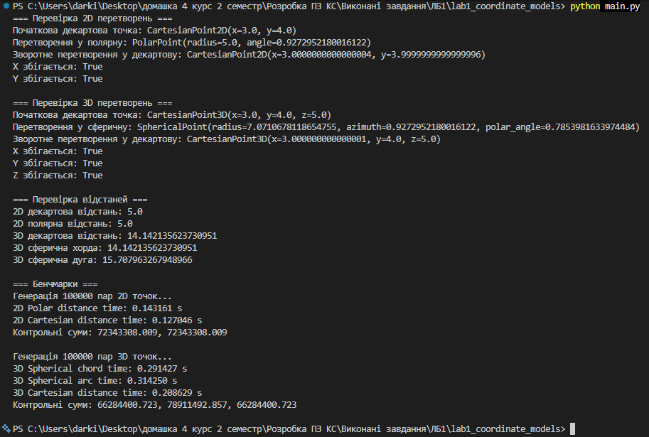

# Лабораторно-практичне заняття №1  
## Програмні моделі систем координат

## 1. Короткий опис роботи

Мета лабораторної роботи — спроєктувати та реалізувати імутабельні програмні моделі для представлення точок у двовимірному та тривимірному просторі, реалізувати перетворення між декартовою, полярною та сферичною системами координат, а також виконати обчислення відстаней між точками різними способами і провести аналіз продуктивності цих обчислень.

У роботі реалізовано такі моделі даних:
- `CartesianPoint2D(x, y)` — точка у двовимірній декартовій системі координат;
- `PolarPoint(radius, angle)` — точка у полярній системі координат;
- `CartesianPoint3D(x, y, z)` — точка у тривимірній декартовій системі координат;
- `SphericalPoint(radius, azimuth, polar_angle)` — точка у сферичній системі координат.

Усі моделі реалізовані як імутабельні за допомогою `@dataclass(frozen=True)`, тому після створення об’єкта його координати не можуть бути змінені.

Також у роботі реалізовано:
- статичні методи перетворення між системами координат;
- обчислення відстані у 2D декартових координатах;
- обчислення відстані у 2D полярних координатах;
- обчислення прямої відстані (хорди) у 3D сферичних координатах;
- обчислення дугової відстані по поверхні сфери;
- бенчмарки для аналізу продуктивності різних підходів.

Усі кутові величини в програмі обробляються в радіанах.

---

## 2. Інструкції для запуску проєкту

### Вимоги до середовища
- Python 3.10+
- Visual Studio Code або будь-яке інше Python-сумісне середовище

### Структура проєкту
- `models.py` — класи точок і методи перетворення;
- `distances.py` — функції для обчислення відстаней;
- `benchmark.py` — генерація тестових даних і бенчмарки;
- `main.py` — запуск перевірки коректності та бенчмарків.

### Запуск програми

1. Відкрити папку проєкту у VS Code.
2. Відкрити термінал.
3. Переконатися, що Python встановлений:

```bash
python --version 
```

4. Запустити проект:

```bash
python main.py 
```

Якщо команда `python` не працює, можна використати:

```bash
py main.py 
```

## 3. Результати перевірки коректності

У процесі виконання програми було перевірено:
- перетворення 2D точки з декартової системи у полярну і назад;
- перетворення 3D точки з декартової системи у сферичну і назад;
- збіг початкових і відновлених координат з урахуванням похибки чисел з плаваючою комою;
- правильність обчислення відстаней у 2D та 3D.

Під час перевірки було отримано такі результати:
- для 2D координати після зворотного перетворення збігаються;
- для 3D координати після зворотного перетворення також збігаються;
- відстань у декартовій та полярній системах для однакових точок має однакове значення;
- пряма відстань у 3D декартовій системі та хорда у сферичних координатах збігаються;
- дугова відстань по поверхні сфери є більшою за хорду, що відповідає математичному змісту.

### Скріншот консольного виводу



---

## 4. Результати аналізу продуктивності (бенчмаркінг)

Для бенчмарків було згенеровано 100000 пар випадкових точок у 2D та 3D просторі. Вимірювання виконувалися окремо лише для циклів обчислення відстаней, без урахування часу генерації даних та попередньої конвертації координат.

### 4.1. Результати для 2D

| Підхід | Час виконання |
|---|---:|
| Polar distance | 0.202474 s |
| Cartesian distance | 0.188842 s |

### Аналіз результатів 2D

Обчислення відстані у декартових координатах виконалося трохи швидше, ніж у полярних. Це пояснюється тим, що у формулі для полярних координат використовується тригонометрична функція `cos`, яка є більш обчислювально затратною. У декартовому представленні використовуються прості арифметичні операції та квадратний корінь, тому такий підхід є швидшим.

### 4.2. Результати для 3D

| Підхід | Час виконання |
|---|---:|
| Spherical chord distance | 0.311797 s |
| Spherical arc distance | 0.514813 s |
| Cartesian distance | 0.372355 s |

### Аналіз результатів 3D

Найшвидшим виявився метод обчислення прямої відстані у сферичних координатах (хорда). Трохи повільніше виконувався декартовий підхід. Найповільнішим став метод обчислення дугової відстані по поверхні сфери, оскільки він додатково використовує функцію `acos`, яка є обчислювально затратною.

Отже, чим складніша математична формула і чим більше вона містить тригонометричних функцій, тим більшим є час її виконання. Це добре видно на результатах проведеного 3D-бенчмарку.

---

## 5. Загальний висновок

Під час виконання лабораторної роботи були закріплені навички проєктування імутабельних моделей даних, реалізації статичних методів перетворення між різними системами координат, а також обчислення відстаней у 2D та 3D просторі.

У ході роботи було підтверджено правильність математичних формул перетворення та обчислення відстаней. Також було проведено аналіз продуктивності, який показав, що обчислення, які містять тригонометричні функції, зазвичай виконуються повільніше, ніж стандартні евклідові формули у декартовій системі координат.

Отримані результати дозволяють зробити висновок, що вибір способу представлення даних впливає не лише на зручність моделювання, але й на швидкодію обчислень.
